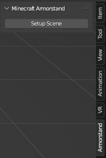
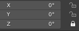

# ArmorstandAnimationAddon
 
Simple Blender Add-on to create an armorstand-Rig, and export the animation as an .mcfunction that can be used in Game

   

## Addon usage
- Create a new Blend File
- Delete the Default Cube
- Go to the armorstand Tab on the right side 

- Now you can animate your armorstand however you like
- Once you're done, you can export your animation as an .mcfunction  via. File > Export > Export Animation (.mcfunction)

## In game use
Simply execute the created .mcfunction on your armorstand every tick
Example: `/execute as @e[tag=myarmorstand] run function mydatapack:myfunction.mcfunction`

The function will automatically increase the internal frame counter.
To start the animation again, you have to reset the frame-counter with this command:
`scoreboard players set @e[tag=myarmorstand,limit=1] armorstand_animation 0`

Alternatively, you can also check "Loop Animation" in the export settings

## Additional Information
By default some axis on the Rig are locked to be easily used with the [Statue Generator](https://raketenben.github.io/statue-generator/) but you can also simply unlock them in case you want to use the tool on normal armorstands

